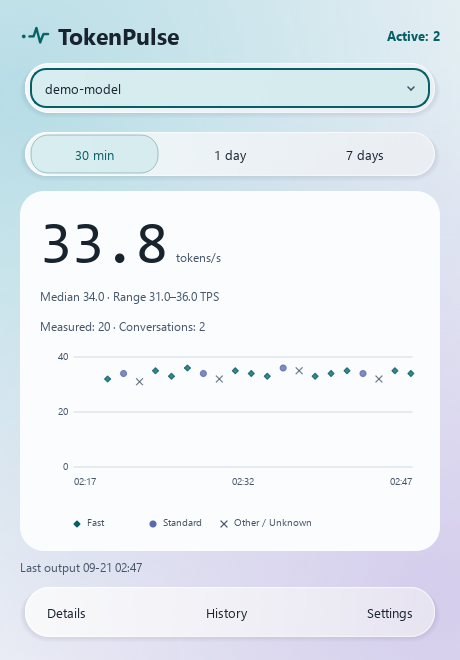
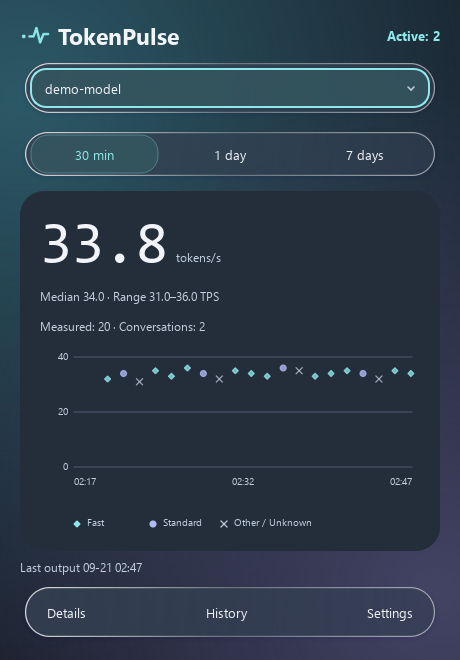

# TokenPulse · 词脉

**A local output-speed monitor for Codex, built with Codex.**

TokenPulse is a read-only tray app for Windows and Linux. Pick a model and a time window to see output speeds across conversations. It reads local Codex logs and keeps your history on your computer.

[](https://github.com/zzccchen/token-pulse/actions/workflows/ci.yml)
[](LICENSE)
[](pyproject.toml)

English · [简体中文](README.zh-CN.md)

<p align="center">
  
  
</p>

*Synthetic demo data, not a model benchmark.*

## What you can see

- **One view per model.** Combine conversations over 30 minutes, 1 day, or 7 days; inspect the weighted average, median, range, and sample count.
- **Every measured output.** Explore a scatter plot, hover for timing and tokens, and open the anonymous record. Keyboard navigation reaches overlapping points.
- **Evidence behind the labels.** Inspect configuration, submitted settings, request values, and server-confirmed values separately. Unknown stays unknown.
- **A quiet tray companion.** Show an optional speed number or use a normal window when a tray is unavailable.
- **Local history.** Filter observations and export CSV. Light/dark themes, reduced effects, English, and Simplified Chinese are included.

TokenPulse reads existing local data. It does not change Codex settings, send model requests, read credential files, or upload telemetry. History excludes conversation text, tool arguments, and titles; identifiers are locally pseudonymized. [Data and privacy →](docs/usage.md#data-and-privacy)

## Try it

**Windows:** download the portable ZIP from [Releases](https://github.com/zzccchen/token-pulse/releases/tag/v0.1.1), extract it, and open `TokenPulse.exe`. Keep the `_internal` folder beside the EXE. Python is included. The build is unsigned; licenses, library sources, and replacement instructions are included in the ZIP.

**From source (Windows or Linux):** you need **Python 3.11+** and [uv](https://docs.astral.sh/uv/getting-started/installation/):

```sh
git clone https://github.com/zzccchen/token-pulse.git
cd token-pulse
uv sync --locked
uv run token-pulse --demo
```

The demo uses isolated synthetic data and needs no Codex account. To observe your local Codex activity, close the demo and run:

```sh
uv run token-pulse
```

The panel opens on startup. Closing it keeps the app in the tray when available; use the tray menu to quit. Without a tray, closing the last window exits.

```sh
uv run token-pulse --no-tray       # Normal window, without a tray
uv run token-pulse --hidden        # Start in tray; fall back to a window
uv run token-pulse --language en   # Language override for this run
```

The source defaults to `CODEX_HOME` or `~/.codex`. Change it in Settings or with `--codex-home`. See the [user guide](docs/usage.md) for storage, export, and troubleshooting.

## What the speed means

```text
Output TPS = output tokens / matching output-stream seconds
Model average = sum(valid output tokens) / sum(matching stream seconds)
```

These are **completed-output estimates from client logs**, not a live token counter or a controlled benchmark. Total output tokens can include reasoning and generated tool calls. Initial waiting and tool execution do not count as generation time.

When tokens and timing cannot be matched reliably, the record remains available but has no TPS. Fast markers describe request or submitted-setting evidence; they do not prove server-side priority. [Measurement rules →](docs/measurement.md)

## Status and limits

TokenPulse is an early **0.1.1** project. Supported versions: **Codex CLI 0.153.4–0.160.0**. Internal log formats can change; see [compatibility](docs/compatibility.md#codex-versions) for details.

| Environment | Validation scope |
| --- | --- |
| Windows 11 x64 | Native tray and window behavior validated locally |
| Ubuntu 24.04 under WSL2 | Wayland window and no-tray fallback validated locally |
| Full Linux desktops | GNOME/KDE/Xfce tray behavior still needs testing |

Missing or rotated logs can leave gaps. Final server-confirmed service tiers are not currently extracted. Remote hosts, other clients, cost tracking, and changing Codex settings are outside the current scope.

Windows portable builds include dependency notices, corresponding Qt/PySide sources, and SHA-256 checksums. Clean-machine Windows testing remains pending. There is no PyPI release or Linux binary yet. [Compatibility](docs/compatibility.md) · [Build instructions](docs/development.md#builds)

## Contribute

Useful first contributions include Linux desktop validation, synthetic format reproductions, translation improvements, and accessibility fixes. Please do not upload real conversation logs.

- [Report a bug](https://github.com/zzccchen/token-pulse/issues/new?template=bug_report.yml)
- [Suggest an improvement](https://github.com/zzccchen/token-pulse/issues/new?template=feature_request.yml)
- [Contribution guide](CONTRIBUTING.md) · [Development](docs/development.md) · [Architecture](docs/architecture.md)
- [Roadmap](ROADMAP.md) · [Security reporting](SECURITY.md)

Found a problem? [Open an issue](https://github.com/zzccchen/token-pulse/issues). English and Chinese are both welcome.

## License

[MIT](LICENSE) for TokenPulse's own code. Dependencies retain their licenses; see [third-party notices](THIRD_PARTY.md).

An independent community project. Not affiliated with or endorsed by OpenAI.
