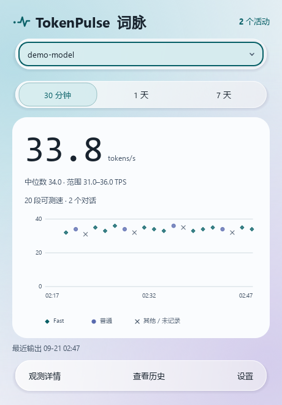
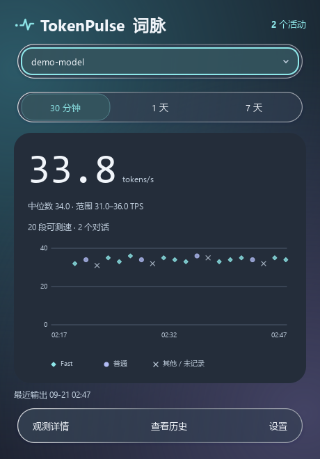

# TokenPulse · 词脉

**一眼看清本机 Codex 的输出速度。**

面向 Windows 和 Linux 的本地只读托盘监视器。选择模型，查看跨对话的已完成输出速度，观测数据留在自己的电脑上。

[](https://github.com/zzccchen/token-pulse/actions/workflows/ci.yml)
[](LICENSE)
[](pyproject.toml)

[English](README.md) · 简体中文

<p align="center">
  
  
</p>

*截图均为合成演示数据，不代表任何模型的性能。*

## 可以看到什么

- **按模型查看。** 汇总跨对话的 30 分钟、1 天或 7 天观测，展示加权平均、中位数、范围与样本数。
- **逐段输出轨迹。** 悬停散点查看时间和 token，点击打开匿名记录，键盘也能访问重叠点。
- **有来源的模式标记。** 分别保留配置、提交设置、请求值和服务端确认值，缺失信息保持未知。
- **简洁托盘。** 可选显示均速数字；没有系统托盘时使用普通窗口。
- **本地历史。** 筛选记录、导出 CSV，支持浅色与深色、减少视觉效果、中文与英文。

词脉只读已有本机数据，不修改 Codex 配置、不发送模型请求、不读取凭据文件、不上传遥测。历史不保存会话正文、工具参数或标题，标识采用本地伪名化处理。[数据与隐私 →](docs/usage.md#data-and-privacy)

## 快速体验

需要 **Python 3.11+** 和 [uv](https://docs.astral.sh/uv/getting-started/installation/)：

```sh
git clone https://github.com/zzccchen/token-pulse.git
cd token-pulse
uv sync --locked
uv run token-pulse --demo
```

演示模式使用隔离的合成数据，无需 Codex 账号。关闭演示后，运行以下命令观测本机 Codex 活动：

```sh
uv run token-pulse
```

启动时显示面板；有托盘时关闭面板仍在后台运行，通过托盘菜单退出。没有托盘时，关闭最后一个窗口即退出。

```sh
uv run token-pulse --no-tray          # 普通窗口，不使用托盘
uv run token-pulse --hidden           # 仅托盘启动，无托盘则显示窗口
uv run token-pulse --language zh_CN   # 本次运行使用中文
```

默认读取 `CODEX_HOME` 或 `~/.codex`，可在设置中或通过 `--codex-home` 更改。存储位置、导出和排查方法见[用户指南](docs/usage.md)；详细技术文档以英文维护。

## 如何理解速度

```text
单段输出 TPS = 输出 token 数 / 与其匹配的输出流秒数
模型平均速度 = 有效输出 token 总数 / 对应输出流累计秒数
```

这是**基于客户端日志的已完成输出估算**，并非实时 token 计数或严格性能基准。总输出 token 可能包含推理和生成的工具调用；生成前等待与工具执行不计入输出时长。

无法可靠匹配 token 与计时边界时，记录仍然保留，但不计算 TPS。Fast 标记来自请求或提交设置，不能证明服务端实际优先处理。[完整测速规则 →](docs/measurement.md)

## 当前状态与边界

项目处于 **0.1.0** 早期阶段，当前适配已观测的 **Codex 0.153.4 系列本地日志格式**；这些内部格式可能变化。

| 环境 | 验证范围 |
| --- | --- |
| Windows 11 x64 | 已在本机验证原生托盘与窗口行为 |
| Ubuntu 24.04 WSL2 | 已在本机验证 Wayland 窗口与无托盘回退 |
| 完整 Linux 桌面 | GNOME/KDE/Xfce 托盘行为仍待验证 |

日志缺失或轮转可能造成数据空缺。当前尚未读取最终服务端确认层级。远程主机、其他客户端、费用统计和修改 Codex 设置不在当前范围内。

目前请从源码运行。可以本地构建 Python 包和 Windows EXE；尚未发布到 PyPI，也没有正式提供可下载的 EXE。[兼容性](docs/compatibility.md) · [构建说明](docs/development.md#builds)

## 参与贡献

欢迎帮助验证 Linux 桌面、提供合成的格式复现、改善翻译和无障碍体验。请不要上传真实会话日志。Issue 支持中文和英文。

- [报告问题](https://github.com/zzccchen/token-pulse/issues/new?template=bug_report.yml)
- [提出建议](https://github.com/zzccchen/token-pulse/issues/new?template=feature_request.yml)
- [贡献指南](CONTRIBUTING.md) · [开发说明](docs/development.md) · [架构](docs/architecture.md)
- [路线图](ROADMAP.md) · [安全问题报告](SECURITY.md)

如果词脉对你有帮助，欢迎点一个 Star，让更多人发现它。

## 许可证

词脉自身代码使用 [MIT](LICENSE)，依赖保留各自许可证，见[第三方说明](THIRD_PARTY.md)。

本项目为独立社区工具，与 OpenAI 无隶属关系，也不代表其官方背书。
