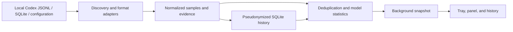

# Architecture

TokenPulse uses Python 3.11+, PySide6 Essentials (Qt Widgets), and SQLite. The parser, statistics, and persistence layers use the Python standard library. Qt provides native desktop entry points without an embedded browser.

## Module map

All paths below are relative to `src/token_pulse/`.

| Module | Responsibility |
| --- | --- |
| `domain.py` | Samples, context, exclusions, evidence reconciliation, task freshness |
| `tailer.py` | Bounded incremental JSONL reads, partial lines, truncation and rotation |
| `collector.py` | Source discovery, path containment, live polling and task state |
| `logs.py`, `submissions.py` | Read-only diagnostics and bounded outer submission parsing |
| `rollout.py` | Event normalization, usage/timing association, fork and replay detection |
| `backfill.py` | Budgeted seven-day historical recovery independent of the live task limit |
| `history.py` | Local HMAC identities, SQLite persistence, revisions, recovery records, CSV |
| `stats.py`, `timeline.py` | Deduplication, model summaries and time-window selection |
| `service.py` | Background ownership of collection/storage and snapshot publication |
| `app.py`, `ui/` | Lifecycle, tray, settings, panel, history and chart |
| `i18n.py`, `locales/` | Offline translation and in-place language refresh |

## Boundaries and invariants

The UI consumes snapshots and never parses raw logs or reads source databases. A background worker owns collection and history access. Live and stored observations share pseudonymized identities before merging.

Source adapters interpret version-dependent internal formats. The normalized model retains unknown evidence rather than guessing it. Exact statistics and exclusion rules are defined in [measurement](measurement.md); source relationships and regression rationale are in [source evidence](source-audit.md).

Live tracking is bounded to 32 recent unarchived tasks. Separate historical recovery covers indexed sessions, including archived ones, in bounded chunks. Completed-file records are saved only after sample persistence; changed files, evidence, or recovery rules trigger re-evaluation. Pending writes are bounded and retried. See [compatibility](compatibility.md) for limits.

Keep platform differences in path discovery, tray/window behavior, and system integration. Statistical tests must run without live Codex accounts or network calls. Do not add a plugin framework for hypothetical future clients.

## UI design

The compact panel prioritizes the chosen model, average speed, and individual-output timeline. Channel/configuration evidence belongs in details; history and settings are secondary windows. Use color and shape together, preserve keyboard access to overlapping points, and provide explicit no-data and stale states.

The glass-inspired appearance is rendered inside the application. It does not capture the desktop or claim native Apple material behavior. Shared control surfaces avoid nested effects; short interaction animations stop when idle or hidden. Reduced transparency and reduced motion provide simpler rendering. Themes use semantic colors and system fonts, with no downloaded fonts. [Design references and attribution](../THIRD_PARTY.md#design-references) are retained separately from implementation instructions.

## Deliberate tradeoffs

- Internal logs offer local observations without changing Codex configuration, but require conservative parsing and version-specific fixtures.
- A Qt/Python app has installation and runtime costs; no memory or CPU targets are claimed without measurement.
- Chinese message keys preserve the existing offline catalog. Public code comments and documentation use English.
- The UI plots samples directly. Existing internal bucket objects also support record-detail scopes; do not remove them solely because the chart is now a scatter plot.
